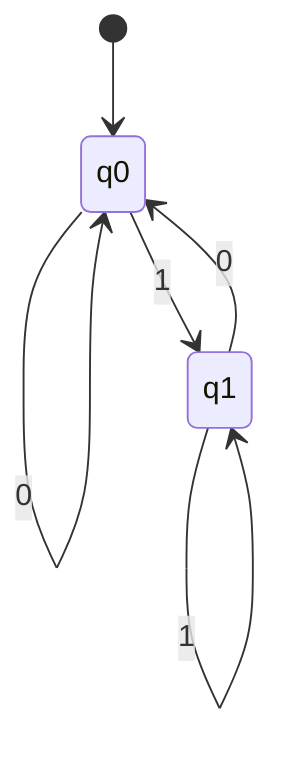

# Aula 05 — Expressões Regulares

## Material do estudante — versão sem gabarito

**Disciplina:** Linguagens Formais e Autômatos  
**Curso:** Engenharia de Software  
**Profª:** Kadidja Valéria  
**Duração sugerida:** 1h30  
**Modalidade:** aula teórico-prática  
**Atividade avaliativa:** reconhecimento e construção de padrões — **0,5 ponto**

---

## Competência da aula

Aplicar expressões regulares para descrever e reconhecer linguagens regulares, justificando a relação entre a especificação da linguagem, a expressão construída e um autômato finito equivalente.

## Objetivos de aprendizagem

Ao final da aula, o estudante deverá ser capaz de:

- compreender o conceito de expressão regular;
- identificar e aplicar seus principais operadores;
- interpretar uma expressão e explicar a linguagem que ela denota;
- construir expressões regulares a partir de uma especificação;
- elaborar casos de teste positivos e negativos;
- distinguir a notação clássica das extensões de motores Regex;
- relacionar expressões regulares, linguagens regulares, DFA e NFA.

## Roteiro sugerido

| Etapa | Tempo | Estratégia |
|---|---:|---|
| Situação-problema e revisão | 15 min | Perguntas e exemplos no quadro |
| Conceito e operadores | 25 min | Exposição dialogada |
| Exemplos resolvidos | 20 min | Construção passo a passo |
| Regex, DFA e NFA | 10 min | Modelagem de estados |
| Exercício guiado | 10 min | Trabalho em duplas |
| Desafio no Regex Learn | 10 min | Teste, correção e justificativa |

---

# 1. Introdução

> **Como podemos descrever, de maneira compacta, todas as cadeias que seguem determinado padrão?**

Considere um sistema que precisa aceitar códigos como `LFA-2026-001` e rejeitar entradas como `LFA26-1`. Seria inviável enumerar todos os códigos possíveis. Precisamos de uma regra finita capaz de representar um conjunto possivelmente infinito de palavras.

Uma **expressão regular** é uma notação para descrever padrões em cadeias. Na prática, pode localizar, extrair ou validar textos. Na teoria de Linguagens Formais, ela denota uma **linguagem regular**.

O ponto de partida não é “qual símbolo Regex devo usar?”, mas:

1. Qual é o alfabeto?
2. Quais propriedades uma palavra válida deve possuir?
3. Quais palavras devem ser aceitas e rejeitadas?
4. A propriedade pode ser reconhecida usando apenas memória finita?

---

# 2. Revisão de conceitos

Considere o alfabeto:

\[
\Sigma=\{0,1\}.
\]

## 2.1 Alfabeto

Um **alfabeto** é um conjunto finito e não vazio de símbolos. Exemplos:

- \(\Sigma=\{0,1\}\);
- \(\Sigma=\{a,b\}\);
- algarismos decimais: \(\Sigma=\{0,1,\ldots,9\}\).

## 2.2 Cadeia ou palavra

Uma **palavra** sobre \(\Sigma\) é uma sequência finita de símbolos do alfabeto. Sobre \(\{0,1\}\), `0`, `101` e `0011` são palavras. Seu comprimento é indicado por \(|w|\); por exemplo, \(|101|=3\).

## 2.3 Cadeia vazia

A cadeia sem símbolos é representada por \(\varepsilon\) e possui comprimento zero:

\[
|\varepsilon|=0.
\]

Não confunda \(\varepsilon\) com o conjunto vazio \(\varnothing\): o primeiro é uma palavra; o segundo é um conjunto sem elementos.

## 2.4 Linguagem

Uma **linguagem** sobre \(\Sigma\) é qualquer subconjunto de \(\Sigma^*\). Exemplo:

\[
L=\{w\in\{0,1\}^*\mid w\text{ termina em }1\}.
\]

Logo, `1`, `01` e `1101` pertencem a \(L\); \(\varepsilon\), `0` e `110` não pertencem.

## 2.5 Operações sobre linguagens

Se \(L_1=\{a,b\}\) e \(L_2=\{0,1\}\):

- **união:** \(L_1\cup L_2=\{a,b,0,1\}\);
- **concatenação:** \(L_1L_2=\{a0,a1,b0,b1\}\);
- **potência:** \(L^0=\{\varepsilon\}\) e \(L^{n+1}=L^nL\);
- **fechamento de Kleene:** \(L^*=\bigcup_{n\geq0}L^n\), incluindo \(\varepsilon\);
- **fechamento positivo:** \(L^+=\bigcup_{n\geq1}L^n=LL^*\), sem \(\varepsilon\), salvo se ela já pertencer a \(L\).

Para \(L=\{a\}\):

\[
L^*=\{\varepsilon,a,aa,aaa,\ldots\},\qquad
L^+=\{a,aa,aaa,\ldots\}.
\]

---

# 3. O que são expressões regulares?

## 3.1 Ideia intuitiva

Uma expressão regular funciona como uma “fórmula” que combina símbolos e operadores para representar uma linguagem. Ela não é uma palavra da linguagem: é uma descrição do conjunto de palavras.

## 3.2 Definição formal clássica

Sobre um alfabeto \(\Sigma\):

1. \(\varnothing\), \(\varepsilon\) e cada símbolo \(a\in\Sigma\) são expressões regulares;
2. se \(r\) e \(s\) são expressões regulares, então \((r|s)\), \((rs)\) e \((r^*)\) também são;
3. nada além do que pode ser obtido pelas regras anteriores é uma expressão regular clássica.

A função \(L(r)\) associa a expressão \(r\) à linguagem que ela representa:

\[
\begin{aligned}
L(\varnothing)&=\varnothing, & L(\varepsilon)&=\{\varepsilon\}, & L(a)&=\{a\};\\
L(r|s)&=L(r)\cup L(s), & L(rs)&=L(r)L(s), & L(r^*)&=L(r)^*.
\end{aligned}
\]

## 3.3 Os Primeiros exemplos

| Expressão | Linguagem representada | Aceitas | Rejeitadas |
|---|---|---|---|
| `a` | \(\{a\}\) | `a` | \(\varepsilon\), `aa`, `b` |
| `a*` | \(\{\varepsilon,a,aa,aaa,\ldots\}\) | \(\varepsilon\), `a`, `aaa` | `b`, `ab` |
| `a+` | uma ou mais ocorrências de `a` | `a`, `aa` | \(\varepsilon\), `b` |
| `a\|b` | \(\{a,b\}\) | `a`, `b` | `ab`, \(\varepsilon\) |
| `(ab)*` | \(\{\varepsilon,ab,abab,\ldots\}\) | \(\varepsilon\), `ab`, `abab` | `a`, `abb`, `ba` |

**Observação:** `a+` é abreviação de `aa*`; não é necessário como operador primitivo na teoria clássica.

---

# 4. Principais operadores

## 4.1 Concatenação

Escrever expressões lado a lado indica sequência. `ab` exige `a` seguido de `b`.

\[
L(ab)=\{ab\}.
\]

Em `(0|1)1`, o primeiro símbolo pode ser `0` ou `1`, e o segundo deve ser `1`: \(\{01,11\}\).

## 4.2 União ou alternância `|`

`a|b` significa “`a` ou `b`”. A alternância une linguagens:

\[
L(a|b)=L(a)\cup L(b).
\]

## 4.3 Fechamento de Kleene `*`

`r*` representa **zero ou mais** concatenações de palavras de \(L(r)\). Portanto, sempre admite \(\varepsilon\).

Exemplo: `(01)*` aceita \(\varepsilon\), `01`, `0101`, ...

## 4.4 Operador `+`

`r+` representa **uma ou mais** ocorrências. É derivável:

\[
r^+=rr^*.
\]

Exemplo: `[0-9]+` aceita `7` e `2026`, mas não a cadeia vazia.

## 4.5 Operador `?`

`r?` representa **zero ou uma** ocorrência:

\[
r?\equiv(r|\varepsilon).
\]

Exemplo: `-?[0-9]+` permite um sinal de menos opcional.

## 4.6 Agrupamento `()`

Os parênteses controlam o alcance dos operadores. Compare:

- `ab*`: `a` seguido de zero ou mais `b`;
- `(ab)*`: zero ou mais blocos `ab`.

## 4.7 Classes `[]` e intervalos

Uma classe escolhe **um** caractere do conjunto:

- `[abc]` equivale, no caso simples, a `(a|b|c)`;
- `[a-z]` indica uma letra minúscula no intervalo;
- `[0-9]` indica um algarismo;
- `[A-Za-z0-9]` indica uma letra ou algarismo.

`[01]*` descreve todas as palavras binárias, inclusive \(\varepsilon\).

## 4.8 Quantificadores

| Recurso | Significado | Exemplo |
|---|---|---|
| `{n}` | exatamente \(n\) ocorrências | `[0-9]{3}` |
| `{n,m}` | entre \(n\) e \(m\) | `[A-Z]{2,4}` |
| `{n,}` | no mínimo \(n\) | `a{2,}` |

Esses quantificadores são abreviações práticas de repetições finitas e estrela; não aumentam o poder expressivo regular.

## 4.9 Âncoras `^` e `$`

- `^` exige o início da entrada;
- `$` exige o fim da entrada.

Para **validar a palavra inteira**, use as duas: `^[01]+$`. Sem âncoras, um motor pode encontrar apenas um trecho válido dentro de uma entrada inválida.

As âncoras expressam posição no texto e pertencem à sintaxe dos motores, não aos operadores fundamentais da definição clássica.

## 4.10 Caractere `.`

Em muitos motores, `.` corresponde a quase qualquer caractere, geralmente exceto quebra de linha. Para reconhecer um ponto literal, use escape: `\.`.

- `a.b` pode aceitar `a7b`, `a-b` ou `a b`;
- `a\.b` aceita literalmente `a.b`.

## 4.11 Precedência

Em geral: repetição (`*`, `+`, `?`, `{}`) > concatenação > alternância (`|`). Prefira parênteses quando houver risco de ambiguidade.

## 4.12 Teoria clássica × motores de programação

| Aspecto | Expressão regular clássica | Motor Regex |
|---|---|---|
| Propósito | Denotar linguagens | Buscar, extrair, substituir ou validar texto |
| Núcleo | \(\varnothing\), \(\varepsilon\), símbolos, união, concatenação e `*` | Inclui classes, âncoras, quantificadores, grupos e escapes |
| Poder | Exatamente linguagens regulares | Depende do motor |
| Execução | Equivalente a autômato finito | Implementação e semântica variam |

Classes, `+`, `?` e repetições limitadas continuam descrevendo linguagens regulares. Porém, alguns motores oferecem **retroreferências**, recursão e outras extensões capazes de descrever propriedades além das linguagens regulares. Por isso, a frase “toda Regex é regular” só é sempre correta quando “Regex” significa **expressão regular no sentido formal**.

---

# 5. Exemplos resolvidos

## Exemplo 1 — Cadeias formadas somente por `0` e `1`

**Problema:** descrever todas as palavras não vazias sobre \(\Sigma=\{0,1\}\).

**Raciocínio:** cada posição pode conter `0` ou `1`; deve existir pelo menos uma posição. Para validação completa, ancoramos início e fim.

**Regex prática:** `^[01]+$`  
**ER clássica equivalente:** `(0|1)(0|1)*`

**Aceitas:** `0`, `1`, `101`, `00110`  
**Rejeitadas:** \(\varepsilon\), `102`, `a01`, `10 1`

**Explicação:** `[01]` seleciona um símbolo binário e `+` exige um ou mais. Se a cadeia vazia também fosse válida, usaríamos `^[01]*$`.

## Exemplo 2 — Cadeias binárias que terminam em `1`

**Problema:** sobre \(\Sigma=\{0,1\}\), aceitar exatamente as palavras cujo último símbolo é `1`.

**Raciocínio:** antes do último símbolo pode haver qualquer sequência binária, inclusive nenhuma. O último símbolo é obrigatório e fixo.

**Regex prática:** `^[01]*1$`  
**ER clássica:** `(0|1)*1`

**Aceitas:** `1`, `01`, `101`, `0001`  
**Rejeitadas:** \(\varepsilon\), `0`, `110`, `12`

**Explicação:** `[01]*` gera o prefixo arbitrário; o `1` final determina a propriedade da linguagem.

## Exemplo 3 — Números inteiros

**Problema:** aceitar inteiros decimais com sinal `+` ou `-` opcional, sem espaços e com pelo menos um algarismo.

**Raciocínio:** a palavra possui dois blocos: sinal opcional e sequência não vazia de algarismos.

**Regex prática:** `^[+-]?[0-9]+$`

**Aceitas:** `0`, `42`, `-8`, `+2026`  
**Rejeitadas:** `+`, `--2`, `3.14`, ` 12`, `12a`

**Explicação:** `[+-]?` permite zero ou um sinal; `[0-9]+` exige um ou mais algarismos. Esta especificação aceita zeros à esquerda, como `007`; proibi-los exigiria outra linguagem, por exemplo `^[+-]?(0|[1-9][0-9]*)$`.

## Exemplo 4 — Código de disciplina

**Problema:** aceitar três letras maiúsculas, hífen e quatro algarismos.

**Raciocínio:** transforme cada regra em um bloco: letras → `[A-Z]{3}`; hífen literal → `-`; algarismos → `[0-9]{4}`.

**Regex prática:** `^[A-Z]{3}-[0-9]{4}$`

**Aceitas:** `LFA-2026`, `ESW-0102`, `MAT-1234`  
**Rejeitadas:** `LF-2026`, `lfa-2026`, `LFA2026`, `LFA-26`

**Explicação:** os quantificadores tornam explícito o comprimento de cada bloco; as âncoras impedem caracteres extras.

## Exemplo 5 — Identificadores de variáveis

**Problema:** aceitar identificadores que começam com letra ou `_` e continuam com zero ou mais letras, algarismos ou `_`.

**Raciocínio:** o primeiro caractere possui regra diferente dos demais. Portanto, separe a expressão em dois blocos.

**Regex prática:** `^[A-Za-z_][A-Za-z0-9_]*$`

**Aceitas:** `x`, `_total`, `nota2`, `valor_final`  
**Rejeitadas:** `2nota`, `valor-final`, `nome completo`, \(\varepsilon\)

**Explicação:** o primeiro bloco é obrigatório; o segundo pode repetir zero ou mais vezes. Palavras reservadas da linguagem de programação exigiriam uma verificação adicional.

## Exemplo 6 — Palavra binária com quantidade par de `1`

**Problema:** aceitar palavras sobre \(\{0,1\}\) com número par de símbolos `1`, incluindo zero ocorrências.

**Raciocínio:** zeros podem aparecer livremente. Os `1` devem surgir em pares, embora possam existir zeros entre os dois símbolos e entre os pares.

**ER clássica:** `0*(10*10*)*`  
**Regex prática:** `^0*(10*10*)*$`

**Aceitas:** \(\varepsilon\), `0`, `11`, `101`, `1100`, `10101`  
**Rejeitadas:** `1`, `10`, `111`, `00100`

**Explicação:** `0*` cobre zeros iniciais. Cada repetição de `(10*10*)` acrescenta exatamente dois `1`, com quaisquer zeros ao redor deles.

---

# 6. Relação com autômatos

\[
\text{Expressões Regulares}
\longleftrightarrow
\text{Linguagens Regulares}
\longleftrightarrow
\text{Autômatos Finitos}
\]

O **Teorema de Kleene** estabelece a equivalência de poder descritivo: uma linguagem é regular se, e somente se, pode ser descrita por uma expressão regular; equivalentemente, se pode ser reconhecida por um autômato finito.

Uma construção conceitual comum é:

1. converter a ER em um \(\varepsilon\)-NFA (construção de Thompson);
2. converter o NFA em DFA (construção dos subconjuntos);
3. opcionalmente minimizar o DFA.

No sentido inverso, pode-se obter uma ER pela eliminação de estados ou por equações de linguagens.

## Exemplo: palavras binárias que terminam em `1`

Para `(0|1)*1`, o DFA precisa lembrar apenas se o símbolo lido mais recentemente é `1`:



- \(q_0\): a entrada está vazia ou o último símbolo não é `1`;
- \(q_1\): o último símbolo lido é `1` — estado de aceitação;
- ao ler `0`, o autômato vai para \(q_0\); ao ler `1`, vai para \(q_1\).

O autômato não armazena toda a palavra; guarda somente a informação finita relevante. Essa é a essência de uma linguagem regular.

---

# 7. Erros comuns

| Erro | Exemplo | Como evitar |
|---|---|---|
| Confundir `*` e `+` | usar `a*` quando ao menos um `a` é obrigatório | pergunte explicitamente se \(\varepsilon\) deve ser aceita |
| Esquecer a cadeia vazia | afirmar que `(ab)*` começa em `ab` | lembre que “zero repetições” produz \(\varepsilon\) |
| Usar `|` sem delimitar | `ab|cd` quando se pretendia `a(b|c)d` | escreva os blocos da linguagem antes da expressão |
| Esquecer agrupamento | `ab*` no lugar de `(ab)*` | marque qual unidade o quantificador deve repetir |
| Confundir `.` e `\.` | `3.14` também reconhece `3x14` | escape o ponto quando ele deve ser literal |
| Omitir âncoras | `[0-9]+` encontra `12` dentro de `abc12x` | para validação total, use `^...$` ou a função de correspondência integral do motor |
| Confiar só em casos válidos | uma expressão aceita os exemplos, mas também entradas indevidas | crie casos negativos de fronteira e quase válidos |
| Começar pela sintaxe | combinar metacaracteres por tentativa e erro | formalize alfabeto, estrutura e restrições primeiro |
| Ignorar o motor | uma sintaxe funciona em uma ferramenta e falha em outra | identifique o “flavor” e consulte sua documentação |

---

# 8. Exercício guiado

Antes de conferir o gabarito, execute este processo:

1. defina o alfabeto;
2. separe a palavra em blocos;
3. identifique escolhas, ordem e repetições;
4. construa exemplos válidos e inválidos;
5. somente então escreva a expressão.

## Exercício 1 — Sufixo `00`

Sobre \(\Sigma=\{0,1\}\), construa uma ER para todas as palavras que terminam em `00`.

**Sua expressão:** ______________________________________________

## Exercício 2 — Exatamente dois `a`

Sobre \(\Sigma=\{a,b\}\), construa uma ER para palavras que possuem exatamente dois símbolos `a` e qualquer quantidade de `b`.

**Sua expressão:** ______________________________________________

## Exercício 3 — Identificador acadêmico

Construa uma Regex prática para um identificador que:

- começa com duas letras maiúsculas;
- possui três algarismos em seguida;
- termina opcionalmente com uma letra minúscula;
- não admite caracteres extras.

**Sua expressão:** ______________________________________________

---

# 9. Desafio final — Código de matrícula acadêmica

Uma universidade adotará códigos de matrícula no formato:

```text
CURSO-ANO-NÚMERO-TURNO
```

## Regras

1. `CURSO` é `CCO`, `ESW` ou `SIS`;
2. há um hífen literal após o curso;
3. `ANO` está entre `2024` e `2029`;
4. há outro hífen;
5. `NÚMERO` possui exatamente quatro algarismos;
6. há outro hífen;
7. `TURNO` é `M`, `T` ou `N`;
8. nenhuma parte extra é permitida.

## Devem ser aceitos

- `CCO-2024-0001-M`
- `ESW-2026-1042-N`
- `SIS-2029-9999-T`
- `CCO-2027-0100-N`
- `ESW-2025-4321-M`

## Devem ser rejeitados

- `ADS-2026-0001-N` — curso inexistente;
- `CCO-2030-0001-M` — ano fora do intervalo;
- `SIS-2027-123-N` — número com apenas três algarismos;
- `esw-2026-1042-N` — letras minúsculas no curso;
- `CCO/2026/0001/M` — separador incorreto;
- `CCO-2026-0001-X` — turno inexistente.

## Descrição formal

Sejam:

\[
C=\{\texttt{CCO},\texttt{ESW},\texttt{SIS}\},\quad
A=\{\texttt{2024},\ldots,\texttt{2029}\},
\]

\[
D=\{0,1,\ldots,9\},\quad T=\{\texttt{M},\texttt{T},\texttt{N}\}.
\]

A linguagem é:

\[
L=\{c\texttt{-}a\texttt{-}d_1d_2d_3d_4\texttt{-}t
\mid c\in C,\ a\in A,\ d_i\in D,\ t\in T\}.
\]

## Produção do estudante

**Regex:**
`^(CCO|ESW|SIS)-202[4-9]-[0-9]{4}-[MTN]$`

**Justificativa por blocos:**
o curso fica entre parenteses com | pq só pode ser um dos 3 (CCO, ESW ou SIS). depois o hifen normal. no ano eu percebi que 2024 até 2029 todos começam com 202, só o ultimo numero muda, entao fixei "202" e deixei [4-9] pra pegar de 4 a 9 (assim não aceita 2030 nem 2023). o numero tem que ter exatamente 4 digitos entao usei [0-9]{4}, se fosse só + ia aceitar qualquer quantidade de digito. no final o turno é só uma letra entre M, T ou N. e coloquei ^ no começo e $ no final pra nao deixar passar nada estranho antes ou depois tipo espaço ou letra a mais.

**Dois novos casos válidos:**
1. SIS-2028-0007-T
2. ESW-2024-9999-N

**Dois novos casos inválidos e motivo:**
1. CCO-2024-00001-M → tem 5 digitos no numero, era pra ter só 4
2. CCO-2024-0001-m → o turno tá minusculo, e a regra só aceita M, T, N maiusculo

## Perguntas para justificar

1. Qual subexpressão representa a escolha entre cursos?
a parte `(CCO|ESW|SIS)`, o | serve pra dizer "ou", entao só um desses 3 precisa bater.

2. Como o intervalo de anos foi limitado sem aceitar `2030`?
deixei "202" fixo e só o ultimo numero varia com [4-9]. como 2030 começa com 203 e nao 202, ele já nem entra no padrao.

3. Por que `{4}` é diferente de `+` no bloco numérico?
{4} obriga ter exatamente 4 digitos. o + deixaria aceitar qualquer quantidade (1, 2, 10 digitos), entao nao ia bater com a regra que pede numero de 4 digitos certinho.

4. Qual é a função das âncoras?
^ e $ garantem que a string toda segue o padrao, do começo ao fim, sem deixar passar texto extra antes ou depois.

5. Sua expressão aceita alguma cadeia que viola as regras? Como os testes sustentam a resposta?
testando os exemplos que a atividade deu (os validos e os invalidos) e mais uns que eu criei, nenhum caso quebrou a regra. entao pelos testes que fiz ela parece certa, mas obviamente testar alguns casos nao é a mesma coisa que provar que ta 100% certo.

## Desafio extra — DFA equivalente

pra nao ficar gigante eu uso classe tipo [0-9] em vez de desenhar cada digito separado, e qualquer simbolo que nao bate vai pro estado sumidouro (q_erro).

estados e o que eles fazem:
- q0: começo, ainda vai ler o curso
- vai ramificando conforme lê C, E ou S (pra CCO, ESW, SIS) até chegar num estado comum depois de terminar o curso
- depois do curso tem que vir um hifen, senão cai no sumidouro
- ai vem os 3 digitos fixos "202" (sem ramificar, só 1 caminho)
- no 4º digito do ano é que ramifica de verdade, indo pra [4-9], qualquer outro digito vai pro sumidouro
- outro hifen
- 4 estados seguidos só pra contar os 4 digitos do numero (cada um lendo [0-9])
- outro hifen
- no turno ramifica entre M, T ou N, e todos os 3 caem no mesmo estado final

estado de aceitação: só tem um, é o ultimo depois do turno certo.

por que caractere extra rejeita: o estado de aceitação nao tem pra onde ir se vier mais alguma coisa depois, entao qualquer coisa a mais joga pro sumidouro (isso faz o mesmo papel do $ da regex). e o sumidouro é tipo uma prisao, uma vez que entra não sai mais, fica preso ali pro resto da cadeia.

---

# 10. Atividade prática no Regex Learn — 0,5 ponto

Use o [Regex Learn Playground](https://regexlearn.com/playground) para testar a expressão do desafio final.

> A ferramenta apoia a verificação; ela não substitui a compreensão da linguagem. Primeiro derive a expressão, depois use os testes para confrontar sua hipótese.

## Procedimento

1. Escreva a Regex com base nos blocos da especificação.
   
```
^(CCO|ESW|SIS)-202[4-9]-\d{4}-[MTN]$
```

2. Insira todos os exemplos que devem ser aceitos.

CCO-2024-0001-M
ESW-2026-1042-N
SIS-2029-9999-T
CCO-2027-0100-N
ESW-2025-4321-M

3. Insira todos os exemplos que devem ser rejeitados.

ADS-2026-0001-N
CCO-2030-0001-M
SIS-2027-123-N
esw-2026-1042-N
CCO/2026/0001/M
CCO-2026-0001-X

4. Crie pelo menos quatro novos casos de teste:
   - um válido em cada limite de ano (`2024` e `2029`);

    2024 -> CCO-2024-0001-M
  
    2029 ->SIS-2029-9999-N
     
   - um inválido “quase correto”;

    CCO-2026-0001-m

   - um inválido com caracteres extras.

    ESW-2026-1042-N!
   
4. Se houver resultado incorreto, identifique qual regra foi representada inadequadamente e corrija a expressão.

Não houve resultado incorreto.

5. Entregue a Regex, a tabela de testes e uma justificativa por blocos.

Regex Final
^(CCO|ESW|SIS)-202[4-9]-\d{4}-[MTN]$

## Registro dos testes

| # | Cadeia | Esperado | Resultado no playground | Regra testada |
|---|---|---|---|---|
| 1 | `CCO-2024-0001-M` | Aceita |  Aceita | caso base |
| 2 | `ESW-2026-1042-N` | Aceita |  Aceita | curso ESW |
| 3 | `SIS-2029-9999-T` | Aceita |  Aceita | curso SIS, limite superior de ano |
| 4 | `CCO-2027-0100-N` | Aceita |  Aceita | número com zero à esquerda |
| 5 | `ESW-2025-4321-M` | Aceita |  Aceita | caso geral |
| 6 | `ADS-2026-0001-N` | Rejeita |  Rejeita | curso inexistente (regra 1) |
| 7 | `CCO-2030-0001-M` | Rejeita |  Rejeita | ano fora do intervalo (regra 3) |
| 8 | `SIS-2027-123-N` | Rejeita |  Rejeita | número com 3 dígitos (regra 5) |
| 9 | `esw-2026-1042-N` | Rejeita |  Rejeita | minúsculas no curso (regra 1) |
| 10 | `CCO/2026/0001/M` | Rejeita |  Rejeita | separador incorreto (regras 2/4/6) |
| 11 | `CCO-2026-0001-X` | Rejeita |  Rejeita | turno inexistente (regra 7) |
| 12 | `CCO-2024-0001-M` | Aceita |  Aceita | limite inferior do intervalo de ano |
| 13 | `SIS-2029-9999-N` | Aceita |  Aceita | limite superior do intervalo de ano |
| 14 | `CCO-2026-0001-m` | Rejeita |  Rejeita | "quase correto" — turno em minúscula |
| 15 | `ESW-2026-1042-N!` | Rejeita |  Rejeita | caractere extra ao final |


## Justificativa por blocos 

| Bloco da regex | Regra que implementa | Evidência nos testes |
|---|---|---|
| `^` | início obrigatório, sem prefixo | caso 15 (mesmo sem sufixo extra no início testado, a âncora simétrica garante isso) |
| `(CCO\|ESW\|SIS)` | regra 1 — curso válido | casos 6 e 9 confirmam rejeição de curso inexistente e minúsculas |
| `-` (×3) | regras 2, 4, 6 — hífens literais | caso 10 confirma rejeição de `/` como separador |
| `202[4-9]` | regra 3 — ano entre 2024 e 2029 | casos 7, 12 e 13 confirmam o intervalo exato nas duas pontas |
| `\d{4}` | regra 5 — exatamente 4 dígitos | caso 8 confirma rejeição de número com 3 dígitos |
| `[MTN]` | regra 7 — turno válido, maiúsculo | casos 11 e 14 confirmam rejeição de turno inválido e de minúscula |
| `$` | regra 8 — nenhuma parte extra | caso 15 confirma rejeição de sufixo extra |

A expressão passou em todos os 15 casos sem ajustes, o que dá evidência de que cada regra do enunciado está mapeada para exatamente uma parte da regex, sem sobras nem lacunas.


## Critérios de avaliação — 0,5 ponto

| Critério | Valor |
|---|---:|
| Correção da expressão em relação às regras | 0,20 |
| Casos de teste positivos, negativos e de fronteira | 0,10 |
| Justificativa conceitual por blocos | 0,10 |
| Análise e correção fundamentada de eventual falha | 0,10 |
| **Total** | **0,50** |

---

# 11. Perguntas de reflexão

1. Toda expressão regular **formal** representa uma linguagem regular?
2. Toda linguagem regular pode ser representada por uma expressão regular?
3. Qual é a relação entre uma ER, um NFA e um DFA?
4. Qual é a diferença entre uma expressão regular teórica e as extensões de motores de programação?
5. Por que um autômato finito reconhece paridade, mas não consegue contar arbitrariamente e comparar duas quantidades sem limite?
6. Por que \(\{a^nb^n\mid n\geq0\}\) não é regular?
7. O que muda ao passarmos de linguagens regulares para linguagens livres de contexto?

**Síntese esperada:** linguagens livres de contexto podem exigir memória não limitada na forma de uma pilha. Por exemplo, em \(a^nb^n\), é necessário conservar quantos `a` foram lidos para comparar com a quantidade posterior de `b`; um DFA possui apenas um número finito de estados.

---

# 12. Resumo final

| Conceito | Significado | Exemplo |
|---|---|---|
| `\|` | alternativa/união | `a\|b` |
| concatenação | sequência | `ab` |
| `*` | zero ou mais | `a*` |
| `+` | uma ou mais | `a+` |
| `?` | zero ou uma | `a?` |
| `()` | agrupamento | `(ab)*` |
| `[]` | classe de caracteres | `[0-9]` |
| `{n}` | exatamente \(n\) | `[0-9]{3}` |
| `{n,m}` | de \(n\) a \(m\) | `[A-Z]{2,4}` |
| `^` | início da entrada | `^abc` |
| `$` | fim da entrada | `abc$` |
| `.` | caractere genérico no motor | `a.b` |
| `\.` | ponto literal | `a\.b` |
| \(\varepsilon\) | cadeia vazia | pertence a `a*` |

## Estratégia de construção em seis passos

1. Defina o alfabeto.
2. Declare precisamente a linguagem.
3. Divida as palavras em blocos.
4. Traduza escolha, ordem e repetição.
5. Teste casos positivos, negativos e de fronteira.
6. Justifique por que a expressão aceita **todas e somente** as palavras desejadas.

> **Ideia central:** uma Regex não é apenas uma sequência de metacaracteres. É uma representação formal de uma linguagem — e, no caso clássico, possui um autômato finito equivalente.

---

# Referências

- HOPCROFT, J. E.; MOTWANI, R.; ULLMAN, J. D. *Introdução à Teoria de Autômatos, Linguagens e Computação*. Rio de Janeiro: Elsevier.
- MENEZES, P. F. B. *Linguagens Formais e Autômatos*. 4. ed. Porto Alegre: Sagra Luzzatto, 2002.
- SOUSA, C. E. B. et al. *Linguagens Formais e Autômatos*. Porto Alegre: SAGAH, 2021.
- REGEX LEARN. *Regex Learn: step by step, from zero to advanced*. Disponível em: <https://regexlearn.com/>. Acesso em: 8 set. 2026.
